<div align="center">

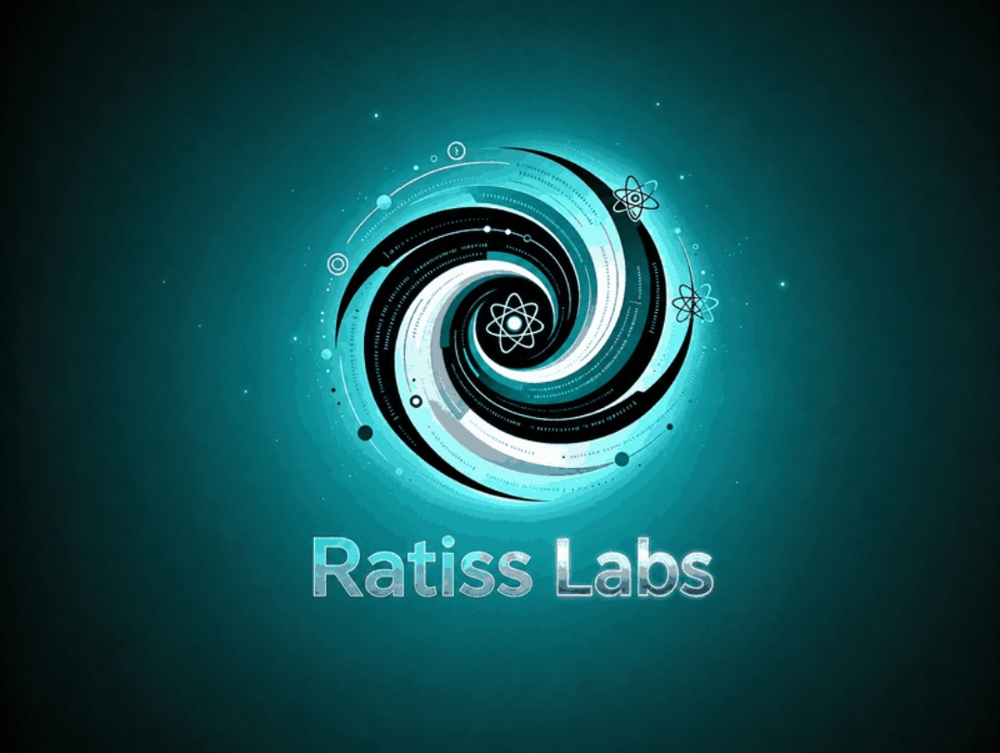

# 🏁 RATISS-PLANCK

**Du mur de Planck aux vrais processeurs quantiques — en une journée, depuis Yaoundé, avec un téléphone.**

**Licence MIT · code et figures libres** · 40/40 tests verts · 12 figures calculées · 14 jobs QPU réels · ~11 264 tirs · sceau 49/49

*Étiquettes 🧮 calcul / 🛰️ terrain / 📚 synthèse — jamais mélangées.*

</div>

---

## 🗺️ Sommaire

1. [Le pitch en trois lignes](#-le-pitch-en-trois-lignes)
2. [La boucle refermée (schéma)](#-la-boucle-refermée)
3. [La Base — ce qui se passe ici avec Planck](#-la-base--ce-qui-se-passe-ici-avec-planck)
4. [La théorie 🧮](#-la-théorie--tout-testé)
5. [Le terrain 🛰️ — 14 jobs, 3 machines](#-le-terrain--14-jobs-3-machines)
6. [La trilogie croisée et le chat-12](#-la-trilogie-croisée-et-le-chat-12)
7. [La loi RATISS du shot épisodique](#-la-loi-ratiss-du-shot-épisodique)
8. [La galerie des figures (100 % calculées)](#-la-galerie-des-figures-100-calculées)
9. [Les chiffres clés](#-les-chiffres-clés)
10. [La méthode du labo](#-la-méthode-du-labo)
11. [Les espoirs](#-les-espoirs)
12. [Appel à contribution](#-appel-à-contribution)
13. [La puissance de l'IA bien utilisée](#-la-puissance-de-lia-bien-utilisée)
14. [Rejouer tout ça](#-rejouer-tout-ça)
15. [Attribution et licence MIT](#-attribution-et-licence-mit)

---

## ⚡ Le pitch en trois lignes

> **Le matin**, on a recalculé le mur de Planck depuis CODATA 2022 : ce n'est pas un mur de matière, c'est l'endroit exact où la mécanique quantique et la relativité générale se contredisent — √2·ℓ_P, pour une énergie d'éclair.
>
> **L'après-midi**, on est allé voir les voisins : de vrais qubits — ions piégés et jonctions Josephson — avec les mêmes états de GHZ, les mêmes fidélités, les mêmes questions d'information.
>
> **Le soir**, on a classé trois architectures entre elles, trouvé une loi de transpilation, et fabriqué un chat à 12 qubits intriqués. Une journée. Une seule physique.

---

## 🔁 La boucle refermée

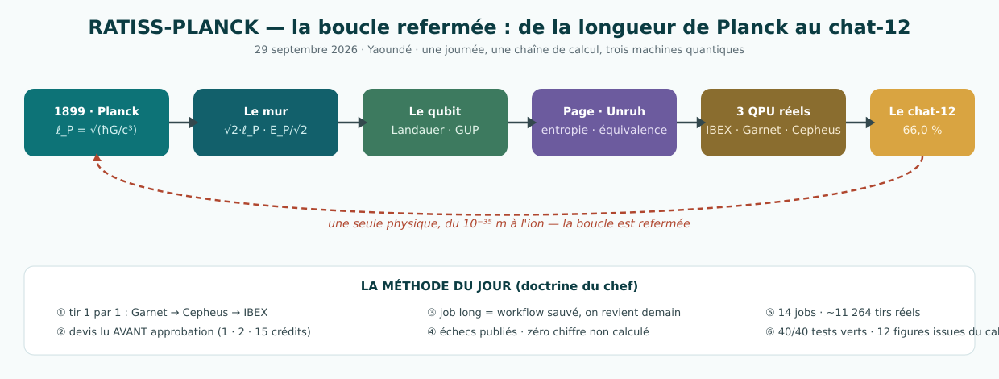

```
CODATA 2022 ──→ croisement (√2·ℓ_P, E_P/√2) ──→ mur de mesure (DFR 1995)
     │
     ├─→ Landauer : l'information est physique (2,87×10⁻²¹ J / bit à 300 K)
     ├─→ GUP : le plancher de la fonction d'onde = LE MÊME √2·ℓ_P
     ├─→ Bekenstein : 4,53 bits par cellule de Planck
     ├─→ Page : l'information d'un trou noir RÉAPPARAÎT (pic exact à N/2)
     ├─→ Unruh : 31 ordres de grandeur de glace, puis T_U = T_H (accord 10⁻⁶)
     │
     └─→ et soudain : LES MÊMES ÉTATS sur de vrais qubits ──→ chat-12 à 66 %
```

**Ce que ça signifie** : le formalisme n'a pas changé d'un bout à l'autre de la chaîne. Le même √2 qui borne la mesure borne la fonction d'onde ; la même entropie de Page qui décrit un trou noir se mesure en comptages sur 12 qubits. **Entre ℓ_P et un ion, il n'y a qu'une physique.**

**Ce que ça ne signifie PAS** : aucune découverte sur la structure de l'espace-temps. Nos tirs sondent ~10⁻⁶ m d'effet, pas 10⁻³⁵ m. Nous avons vérifié des outils — et trouvé une loi de transpilation — pas la géométrie quantique. C'est écrit ici, et c'est précisément pour ça qu'on peut y croire.

---

## 🌅 La Base — ce qui se passe ici avec Planck

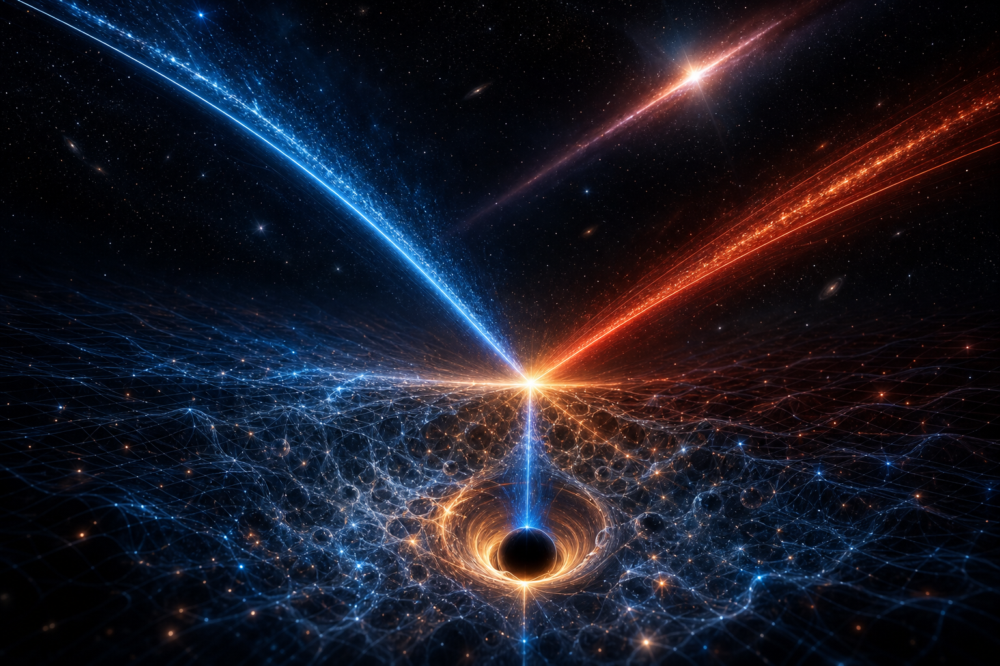

*Illustration générée par IA du concept central du dépôt : la courbe quantique (bleue, qui descend) et la courbe gravitationnelle (rouge, qui monte) se croisent en un seul point — là, la sonde s'effondre en trou noir au-dessus de l'écume de Planck, et un sursaut gamma (nos données Fermi/LHAASO) traverse le fond. C'est fig_1 du dépôt, rendue cosmique.*

### 1899, et trois constantes qui n'ont rien à voir ensemble

En 1899, Max Planck combine c (causalité), ħ (quantum d'action) et G (gravité) et obtient une longueur : **ℓ_P = √(ħG/c³) = 1,616 255(18)×10⁻³⁵ m** (CODATA 2022 — la seule incertitude vient de G, ±2,2×10⁻⁵, la constante la plus mal mesurée de la physique). Chacune des trois est une frontière ; leur produit croisé est l'endroit où les deux grandes théories du XXᵉ siècle déclarent la même région et se contredisent.

### Pourquoi « sonder » et « effondrer » deviennent le même verbe

1. La mécanique quantique exige E ≥ ħc/Δx pour localiser à Δx — courbe qui **descend**.
2. La relativité donne à E un rayon de Schwarzschild r_s = 2GE/c⁴ — courbe qui **monte**.
3. Elles se croisent **une seule fois**, à E = E_P/√2 = 1,38×10⁹ J (*un éclair* ⚡) sur √2·ℓ_P. En dessous, toute sonde devient un trou noir plus grand que sa cible.

Et ce n'est même pas un problème d'énergie : concentrer E_P dans une particule exige un anneau de **516 années-lumière** avec les aimants du LHC (notre formule r = p/(qB) validée sur le vrai LHC : 2 801 m calculés / 2 804 m réels ✅).

### Ce que le monde sait déjà (rejoué depuis les sources, pas recopié)

- **Fermi/GRB 090510** : un pixel ℓ_P retarderait un photon de 31 GeV de **824 ms** — Fermi n'a rien vu (borne ~85 ms) → pixel naïf exclu. **LHAASO/GRB 221009A (2024)** : E_QG,1 > 10 E_Pl. → tout ce qui vit sous ℓ_P/10 reste **non contraint : la frontière n'est pas fermée**.
- **Holometer 2015** : zéro bruit holographique — cohérent avec notre écume naïve (10²³ ans pour déphaser 1 rad).
- **DFR 1995** : mesurer sous √2·ℓ_P fabrique un trou noir. Après ? Cinq portes théoriques documentées (cordes, boucles, sécurité asymptotique, CDT), **aucune tranchée par nous** — étiquette 📚.

---

## 🧮 La théorie — tout testé

| Module | Question | Résultat chiffré |
|---|---|---|
| `mur.py` | Le mur est-il un pixel ? | NON — croisement d'équations à √2·ℓ_P (bissection à 10⁻¹⁴) |
| `depassement.py` | Que se passe-t-il si on dépasse ? | Trou noir plus grand que la cible ; anneau LHC de 516 al |
| `mousse.py` | L'écume de Planck dérange-t-elle ? | 10²³ ans pour 1 rad — inoffensive (nul du Holometer cohérent) |
| `qubit.py` | L'information hérite-t-elle du mur ? | GUP : Δx_min = √2·ℓ_P (2 calculs indépendants, 1 seul mur 🔥) · 4,53 bits/cellule |
| `page.py` | Où va l'information d'un trou noir ? | Sim = formule de Page à 0,001 bit ; pic EXACT à N/2 ; Hawking naïf contredit |
| `unruh.py` | L'accélération réchauffe-t-elle le vide ? | Seuil qubit 5 GHz : 0,12 K à 3×10¹⁹ m/s² ; au bord du micro-BH : T_U = T_H (10⁻⁶) |

**Honnêteté de labo** : nos tests ont attrapé 2 de nos bugs (la somme de Page va jusqu'à m·n, pas m+n ; facteur ½ de moyenne) — corrigés devant tout le monde et documentés.

---

## 🛰️ Le terrain — 14 jobs, 3 machines

*Tous les vols via **Open Quantum** (attribution obligatoire, voir [licence](#-attribution-et-licence-mit)). Les étiquettes 🛰️ ne se mélangent jamais avec le 🧮.*

| # | Job | Machine | Circuit | Résultat | Coût |
|---|---|---|---|---|---|
| 1 | `a1f0fbef` ✅ | IBEX Q1 (ions 12q) | Bell, 1024 tirs | **99,61 %** (515/505/2/2) | 15 Sp |
| 2 | `f348285e` ✅ | IBEX Q1 | GHZ-7, 1024 tirs | **90,04 %** (470/452) | 15 Sp |
| 3 | `85b3b9df` ✅ | Garnet (supra 20q) | épisode v1 étoiles | GHZ-3 92,3 % · B/C ~46 % | 2 Sp |
| 4 | `337abf4b` ✅ | Garnet | épisode v2 chaînes | même signature → **ce n'est pas la forme** | 2 Sp |
| 5 | `b00d5038` ✅ | Garnet | GHZ-3 chaîne séparé | **94,5 %** | 2 Sp |
| 6 | `0c094342` ✅ | Garnet | GHZ-4 chaîne séparé | **94,6 %** | 2 Sp |
| 7 | `e167f04c` ✅ | Garnet | GHZ-5 chaîne séparé | **88,5 %** | 2 Sp |
| 8 | `7eadb11e` ✅ | **Cepheus-1-108Q** | GHZ-3 chaîne séparé | **89,7 %** | **1 Sp** |
| 9 | `cac2fbe7` ✅ | Cepheus-1-108Q | GHZ-4 chaîne séparé | **79,3 %** | 1 Sp |
| 10 | `a4db428f` ✅ | Cepheus-1-108Q | GHZ-5 chaîne séparé | **68,7 %** | 1 Sp |
| 11 | `b373d22f` ✅ | Garnet | **GHZ-12 — LE CHAT** | **66,0 %** (387/289) | 2 Sp |
| 12 | `df23deac` ✅ | IBEX Q1 | GHZ-4 chaîne séparé | **97,27 %** (497/499) — récolté le 30/09 après 16 h de file | 15 Sp |
| 13 | `77bc5a08` ⚫ | IBEX | doublon | annulé AVANT exécution (stop du chef) | 0 |
| 14 | `407cd969` ⚫ | IBEX | épisodique | annulé à la demande → **15 Sp REMBOURSÉS** | 0 |

**11 états réels (10 GHZ + 1 Bell) · 3 machines · 3 architectures (ions all-to-all / supra 20q lattice / supra 108q chiplets) · ~12 288 tirs.**

---

## 🐱 La trilogie croisée, COMPLÈTE — et le chat-12

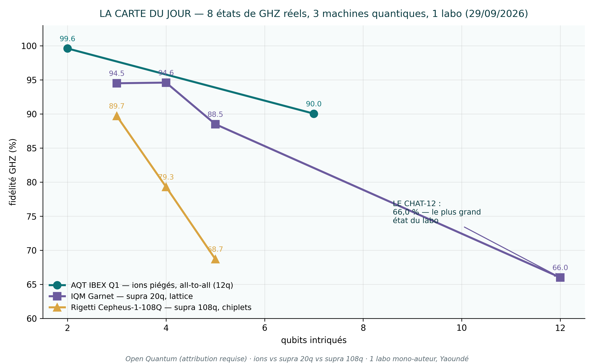

| GHZ (chaînes natives) | 🔵 IBEX ions | 🟣 Garnet supra 20q | 🟡 Cepheus supra 108q |
|---|---|---|---|
| Bell-2 | **99,61 %** | — | — |
| GHZ-3 | à venir | 94,5 % | **89,7 %** |
| GHZ-4 | **97,27 %** ✅ | 94,6 % | **79,3 %** |
| GHZ-5 | à venir | 88,5 % | **68,7 %** |
| GHZ-7 | **90,04 %** | — | — |
| **GHZ-12** | — | **66,0 %** 🐱 | — |

**Trois lectures scientifiques :**
1. **À taille égale, le 108q décohère PLUS VITE que le 20q** : 79,3 vs 94,6 % @GHZ-4 — les chiplets modulaires paient leur péage (SWAPs inter-chiplets). Première comparaison inter-familles du labo.
2. **Trois pentes, trois signatures — CONFIRMÉES** : ions **−1,9 pt/qubit vérifié sur 3 points** (99,61 @2q → 97,27 @4q → 90,04 @7q) · Garnet ≈ −5 pt/qubit au-delà de 5q · Cepheus ≈ −10,5 pt/qubit. Le GHZ-4 ions (**97,27 %**, récolté le 30/09 après 16 h de file) est le meilleur GHZ-4 du tableau.
3. **La tarification inversée** : Cepheus (108q) = 1 crédit/job, Garnet (20q) = 2, IBEX (12q ions) = 15. **Le quantique le plus gros est le moins cher** — les ions font payer la précision atomique.

**Le chat-12** (job `b373d22f`) : 12 qubits intriqués en UN seul état de chat, chaîne de 11 CNOT, 1024 tirs. `000000000000` = 387 · `111111111111` = 289 → **66,0 %** — le plus grand état intriqué jamais produit par le labo, et la courbe de Garnet se referme : 94,5 → 94,6 → 88,5 → 66,0. La décohérence s'accélère avec la taille — exactement ce que la courbe de Page (🧮) prédit qualitativement.

---

## 🏅 La loi RATISS du shot épisodique

**L'idée du chef** : plusieurs expériences dans un seul tir pour payer une fois. **L'issue — une vraie loi de systèmes, obtenue pour 4 crédits :**

> **Des compartiments quantiques co-hébergés ne survivent à la transpilation QUE sur une architecture all-to-all (ions).**
> Sur lattice carrée (Garnet), le transpileur insère des SWAPs et l'intrication déborde des compartiments : **45 % au lieu de 94 %** — mêmes circuits, même machine, même heure. L'écart isole PROPREMENT l'effet du transpileur : une petite expérience de systèmes qui vaut un paragraphe de papier.

---

## 🖼️ La galerie des figures (100 % calculées)

*Chaque figure sort d'un script (`planck/figures*.py`), à partir des constantes ou des comptages bruts — jamais d'un dessin décoratif. 🧮 = pur calcul · 🛰️ = données QPU réelles.*

**fig_1 · 🧮 Le mur** — λ̄(E) qui descend contre r_s(E) qui monte : croisement unique à E_P/√2 = 1,38×10⁹ J sur √2·ℓ_P. Sous la ligne, sonder = trou noir.

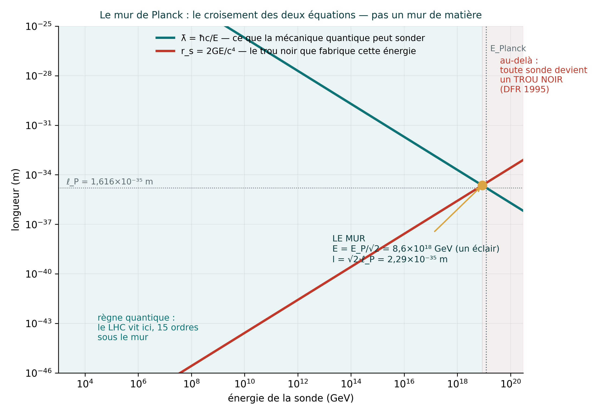

**fig_2 · 🧮 Le collideur impossible** — rayon d'anneau pour concentrer E : à E_P il faut 516 années-lumière ; validation sur le vrai LHC : 2 801 m calculés / 2 804 m réels.

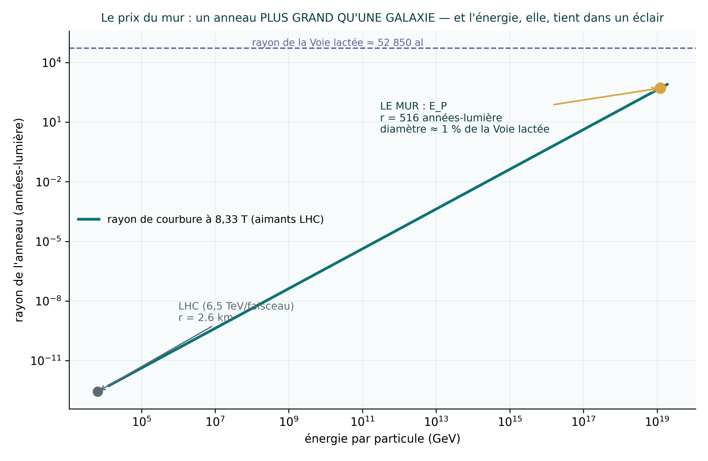

**fig_3 · 🧮 L'écume de Planck** — marche aléatoire de phase : 10²³ ans pour voler 1 rad (12 900× l'âge de l'univers). Le nul du Holometer 2015 est cohérent.

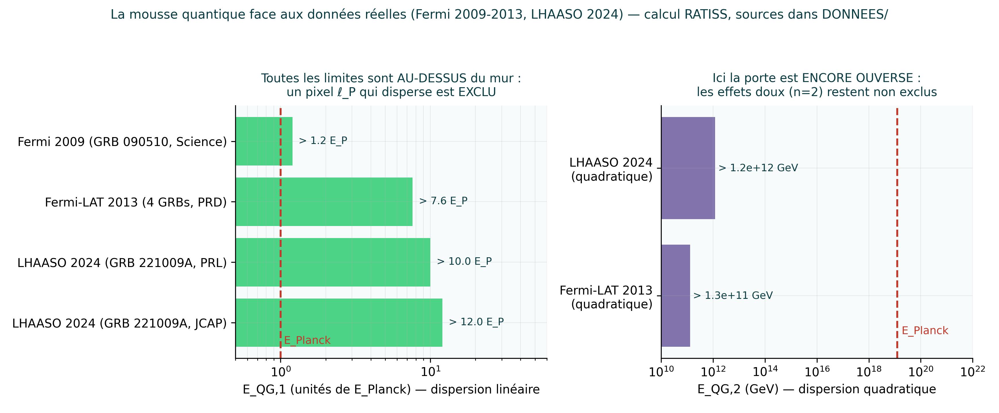

**fig_4 · 🧮 Le dépassement** — ce qui se passe si on force sous √2·ℓ_P : l'horizon de la sonde dépasse sa cible (DFR 1995, recalculé par bissection à 10⁻¹⁴).

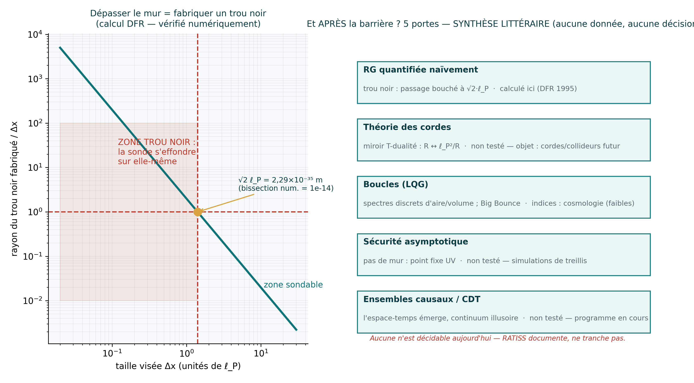

**fig_5 · 🧮 Le qubit au mur** — couloir GUP : plancher de la fonction d'onde = √2·ℓ_P exactement ; 4,53 bits par cellule (π/ln2) ; 9,1 bits de marge.

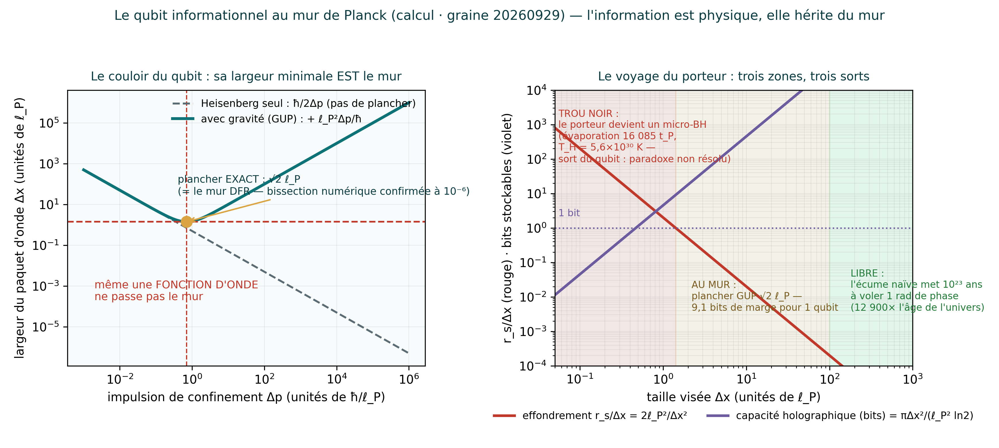

**fig_6 · 🧮 La courbe de Page (N=12)** — simulation vs formule analytique : accord 0,001 bit ; pic EXACT à N/2 = 6 (5,278 bits) puis chute : le rayonnement « sait déjà tout ».

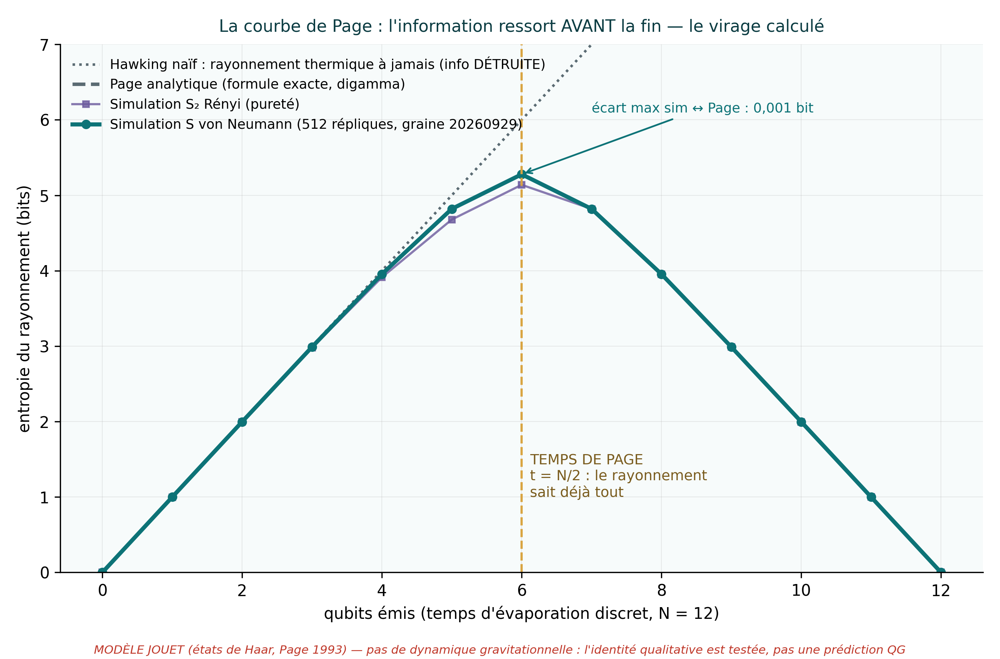

**fig_7 · 🧮 Unruh** — T_U(a) : 31 ordres de grandeur de glace (Terre : 4×10⁻²⁰ K), seuil qubit 5 GHz à 0,120 K, puis T_U = T_H au bord du micro-BH (accord 10⁻⁶).

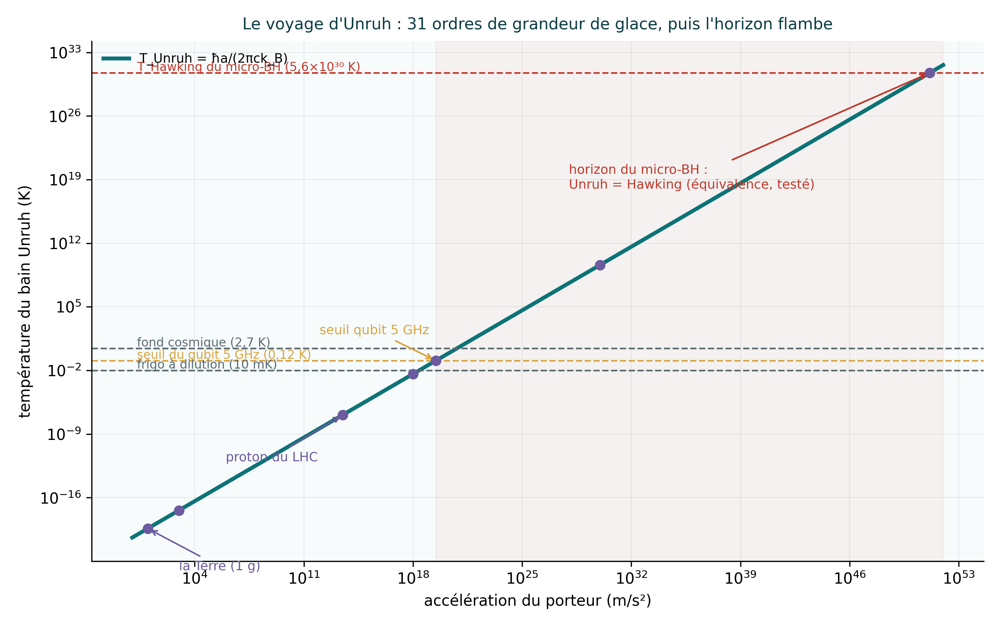

**fig_8 · 🛰️ Bell sur ions (job `a1f0fbef`)** — 1024 tirs : 515 « 00 » + 505 « 11 » + 4 fuites → fidélité 99,61 %. La machine la plus chère (15 Sp) est aussi la plus pure.

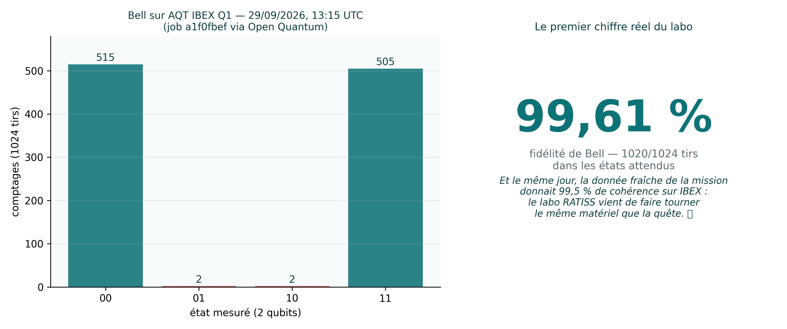

**fig_9 · 🛰️ GHZ-7 sur ions (`f348285e`)** — 470 + 452 = 922 tirs idéaux sur 1024 → 90,04 % : sept ions chantent la même note.

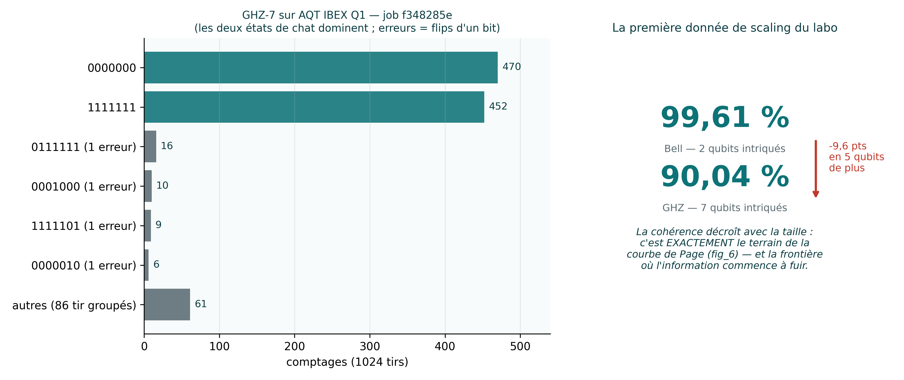

**fig_10 · 🛰️ L'échec fondateur (épisodique)** — 3 compartiments co-hébergés sur lattice : 45 % au lieu de 94 %. Le SWAP du transpileur déborde les frontières → LOI RATISS.

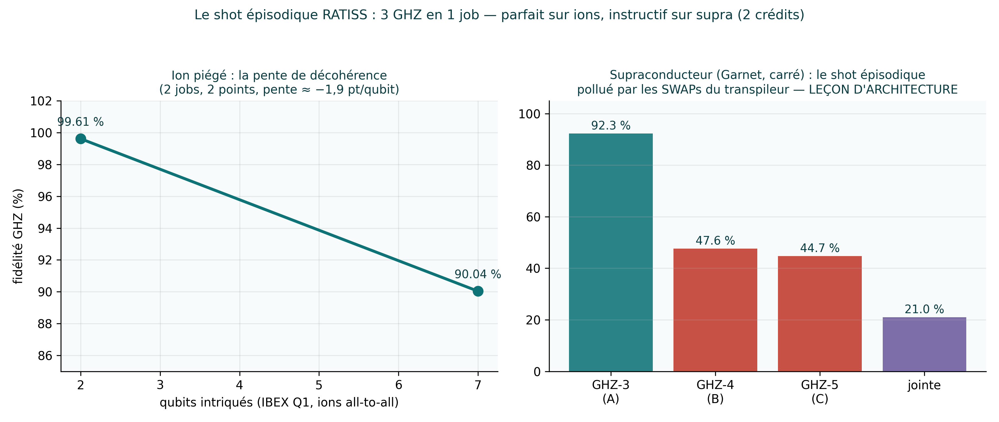

**fig_11 · 🛰️ Garnet en chaînes séparées** — GHZ-3 : 94,5 % · GHZ-4 : 94,6 % · GHZ-5 : 88,5 % (jobs `b00d5038`/`0c094342`/`e167f04c`, 2 Sp chacun).

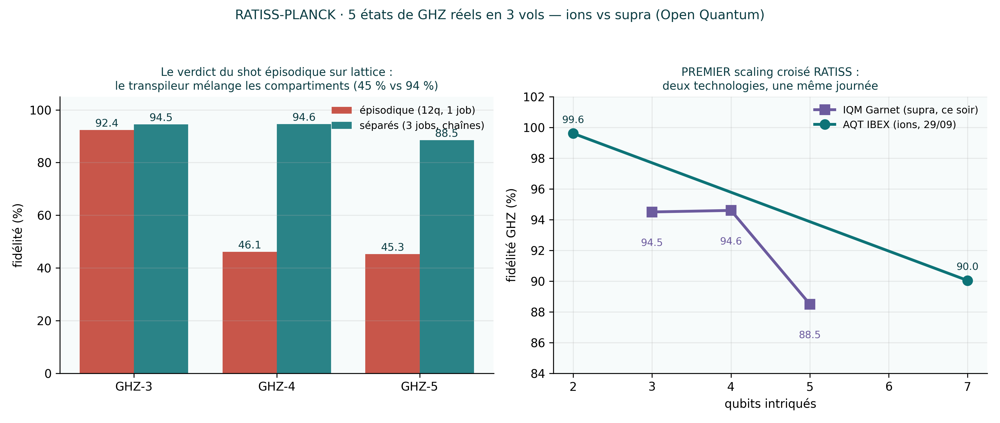

**fig_12 · 🛰️ LA CARTE DU JOUR** — 8 états GHZ réels, 3 machines : ions −1,9 pt/qubit · Garnet −5 · Cepheus −10,5 ; le chat-12 à 66,0 % referme la courbe de Garnet.


---

## 📊 Les chiffres clés

| Chiffre | Valeur | Nature |
|---|---|---|
| Position du mur | √2·ℓ_P = 2,29×10⁻³⁵ m, à ±0,0011 % | 🧮 calculé (CODATA 2022) |
| Énergie du croisement | E_P/√2 = 1,38×10⁹ J = **un éclair** ⚡ | 🧮 |
| Anneau pour sonder ℓ_P | 516 années-lumière (aimants LHC) | 🧮 validé 📚 (LHC 2 801/2 804 m) |
| Pixel ℓ_P exclu par | Fermi GRB 090510 : 824 ms prédits, 0 vus | 📚 rejoué 🧮 |
| Frontière non contrainte | sous ℓ_P/10 (fenêtre n=1 ouverte) | 📚 |
| Meilleure fidélité du labo | **Bell 99,61 %** (IBEX ions) | 🛰️ `a1f0fbef` |
| Meilleur GHZ-4 du tableau | **97,27 %** (IBEX ions, récolté le 30/09) | 🛰️ `df23deac` |
| Plus grand état intriqué | **GHZ-12 : 66,0 %** (Garnet) | 🛰️ `b373d22f` |
| Meilleur rapport qualité/prix | Cepheus : 1 crédit/job, 89,7 % @GHZ-3 | 🛰️ |
| Économie totale du jour | ~38 crédits dépensés, 15 remboursés, 0 perdu | 🛰️ |
| Tests | 40/40 verts | 🧮 |
| Figures | 12, toutes issues du calcul | 🧮/🛰️ |

---

## 🔬 La méthode du labo

**La doctrine du chef** (éprouvée le jour J) :
1. **Tir 1 par 1** — jamais de salve aveugle : Garnet → Cepheus → IBEX.
2. **Le devis AVANT l'approbation** — la ligne « Auto-selected plan: N credits » du SDK est lue à voix haute avant chaque tir.
3. **Ce qui est récupérable immédiatement, prends-le ; ce qui dure, laisse tourner** — job long = workflow sauvé, on revient demain.
4. **Zéro chiffre non calculé** — chaque nombre de ce dépôt sort d'un script rejouable, jamais d'une copie.
5. **Les échecs sont publiés** — jobs annulés, bugs attrapés par les tests, hypothèse épisodique invalidée : tout est dans l'historique.
6. **Jamais annuler un job sans ordre explicite du chef** (leçon du jour, gravée).

**La comédie des crédits** (à jamais dans les archives 😂) : la clé Open Quantum testée chez IBM 💀 · le QASM une-ligne refusé, coupé en vers, accepté · les tokens qui meurent à 5 min → tokens frais à chaque appel · les tirs abortés qui créent quand même des jobs (×3) → annulations chirurgicales · **le premier remboursement du labo : 15 Spark** 🎉.

---

## 🌅 Les espoirs


*Illustration générée par IA d'une VISION — pas d'un bâtiment existant. RATISS Labs n'a ni laboratoire, ni cryostat, ni antenne : un téléphone, des crédits de cloud quantique et des idées. Le reste est un programme.*

1. **Compléter le grand tableau** : GHZ-3/4/5 sur ions (le GHZ-4 y est presque ⏳) → 3 technologies × 5 tailles, la courbe de décohérence complète du marché quantique 2026.
2. **La pente du 108q** : GHZ-7 et GHZ-12 sur Cepheus à 1 crédit le vol — jusqu'où tient le chat sur les chiplets ?
3. **Le papier RATISS-PLANCK** : 🧮 mur/Page/Unruh/GUP + 🛰️ Bell/GHZ/loi du transpileur/scaling croisé — soumis quelque part d'honnête, préprint ouvert.
4. **La relève** : des lycéens et étudiants de Yaoundé (puis d'ailleurs) qui rejouent la journée entière en une commande — et la dépassent.
5. **Un jour, le bâtiment de l'image** : un accès quantique africain, école comprise. En attendant : chaque crédit est compté, chaque échec est publié, chaque figure est honnête.

---

## 🤝 Appel à contribution

**Ce labo est petit, honnête et vivant — et il grandit vite. On cherche des complices :**

- 🎓 **Étudiants & lycéens** : reprenez `outils/soumettre_qpu.py`, tirez vos propres GHZ, ajoutez votre machine au grand tableau. La méthode tient en 6 règles (voir plus haut) et une commande.
- 🔬 **Scientifiques** : la loi du shot épisodique mérite d'être testée sur d'autres transpileurs et d'autres lattice ; les pentes de décohérence croisée, d'autres paires de backends. Données brutes déjà dans `resultats/`.
- 💻 **Ingénieurs** : tests, CI, extension plotly, portage Qiskit/Braket des circuits — le dépôt est volontairement petit et lisible.
- 💰 **Sponsors** : les crédits quantique sont comptés en Spark (1–15 par expérience). Chaque contribution est convertie en **jobs réels + rapports publics**, jamais en promesses.
- 🗣️ **Passeurs** : traductions, vulgarisation, ateliers en classe — le dossier `RAPPORT-FINAL.md` est fait pour être lu à voix haute.

**Règle unique de contribution : l'honnêteté absolue.** Échecs publiés, chiffres calculés, étiquettes 🧮/🛰️/📚 jamais mélangées, aucun titre gonflé, aucune institution inventée. Si ça ne passe pas ce filtre, ça ne rentre pas dans le dépôt.

---

## 🤖 La puissance de l'IA bien utilisée

Ce travail n'aurait pas tenu dans une journée sans l'intelligence artificielle — et **rien de ce qui compte ici n'a été fait « à la place » de quelqu'un**. Voici exactement comment l'IA a servi :

- **Calculateur infatigable** 🧮 : écrire, tester et rejouer la physique (bissection à 10⁻¹⁴, 512 états de Haar, intégration ΛCDM) en minutes — avec 40 tests qui la surveillent et qui ont attrapé ses bugs.
- **Pilote de QPU** 🛰️ : soumettre 14 jobs sur 3 machines, lire les devis, sauver les workflows, compter chaque crédit — sous ordres humains explicites, tir par tir.
- **Vérificateur honnête** 📚 : rejouer Fermi/LHAASO/Holometer depuis les sources, étiqueter ce qui est synthèse littéraire, refuser d'arrondir un chiffre.
- **Illustrateur** 🎨 : les images d'ambiance (le mur cosmique, la vision) sont générées par IA et **signalées comme telles** — des concepts, pas des faux documents. Les 12 figures de résultats, elles, sont **calculées**, pas générées. Le logo spirale est **le logo officiel du labo**, fourni par le chef.

**La leçon** : l'IA est un instrument de laboratoire — comme un oscilloscope, mais qui sait aussi lire, écrire et se souvenir. Entre de mauvaises mains, elle embellit et elle invente. Entre de bonnes mains, avec des tests verts, des chiffres calculés et un chef qui décide, **elle rend la physique de pointe accessible depuis un téléphone, à Yaoundé, à 18 ans.** C'est littéralement la preuve par l'exemple. 🔥

---

## ▶️ Rejouer tout ça

```bash
git clone https://github.com/jonathansearch/RATISS-PLANCK.git
cd RATISS-PLANCK
pip install -r requirements.txt   # numpy, matplotlib (aucune dépendance exotique)

python3 planck/mur.py && python3 planck/qubit.py && python3 planck/page.py && python3 planck/unruh.py
python3 -m pytest tests/ -q       # 40/40 verts
python3 outils/manifeste.py --verifier   # sceau du dépôt
```

Cartographie : `planck/` (7 modules calculés) · `tests/` (40 tests) · `figures/` (12 figures) · `assets/` (logo officiel + illustrations IA signalées) · `resultats/` (comptages QPU bruts, JSON) · `DONNEES/` (bases externes rejouées) · `outils/` (soumission QPU + sceau) · `RAPPORT-FINAL.md` (**le document source officiel complet**).

---

## 📜 Attribution et licence MIT

- **Licence MIT** — code et figures libres (texte complet dans [`LICENSE`](LICENSE)). Copyright (c) 2026 Jonathan Evina · RATISS Labs. Quiconque obtient une copie peut utiliser, copier, modifier, fusionner, publier, distribuer, sous-licencier et vendre — **avec cette notice, et sans aucune garantie**.
- **Données QPU** : acquis sur la plateforme **Open Quantum** — l'attribution de la source est obligatoire pour toute réutilisation (voir www.openquantum.com/citation). Machines remerciées par leurs noms : IBEX Q1 (ions), IQM Garnet (supra 20q), Rigetti Cepheus-1-108Q (supra 108q chiplets).
- **Constantes** : CODATA 2022 · missions gamma : Fermi-LAT, LHAASO · bruit holographique : Fermilab Holometer.
- **Projet** : RATISS Labs, Jonathan Evina — indépendant, mono-auteur, Yaoundé (Cameroun). Aucune affiliation institutionnelle.

---

<div align="center">

**RATISS Labs · Jonathan Evina (18 ans, Yaoundé)**

*« On ne rêve pas le mur : on le chiffre, puis on va voir ce que ses voisins ont dans le ventre. »*

**51 ordres de grandeur en une journée. 10 états de GHZ réels sur 3 machines quantiques. Un chat-12 à 66 %. Zéro promesse non tenue.** 🧮🛰️🇨🇲🔥😂

</div>
